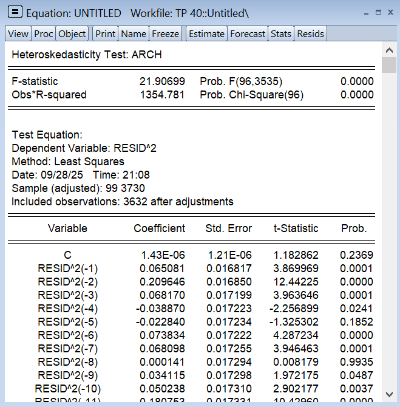
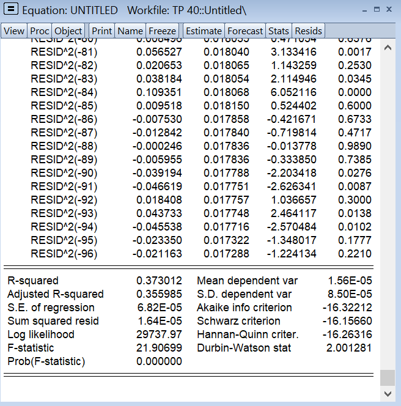

## Method
The **ARCH-LM test** was performed on the residuals of the estimated ARMA/ARIMA model.
Null Hypothesis (H0):
There is no ARCH effect (the variance of residuals is constant).
Alternative Hypothesis (H1):
ARCH effects are present (variance changes over time).
## Software
The analysis was conducted using **EViews**.
## Outputs
This folder includes:
- ARCH-LM test statistics
- Residual diagnostic plots
- Supporting outputs used for volatility analysis
- 
- 
- 
